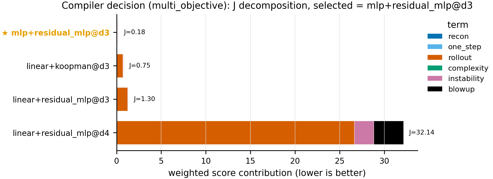
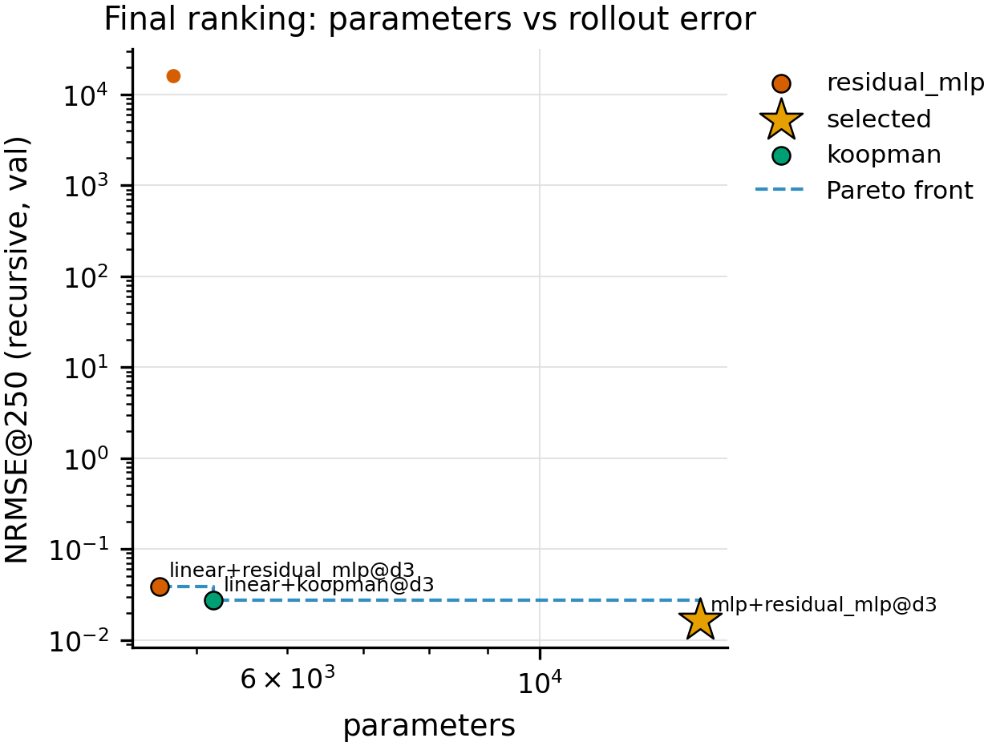
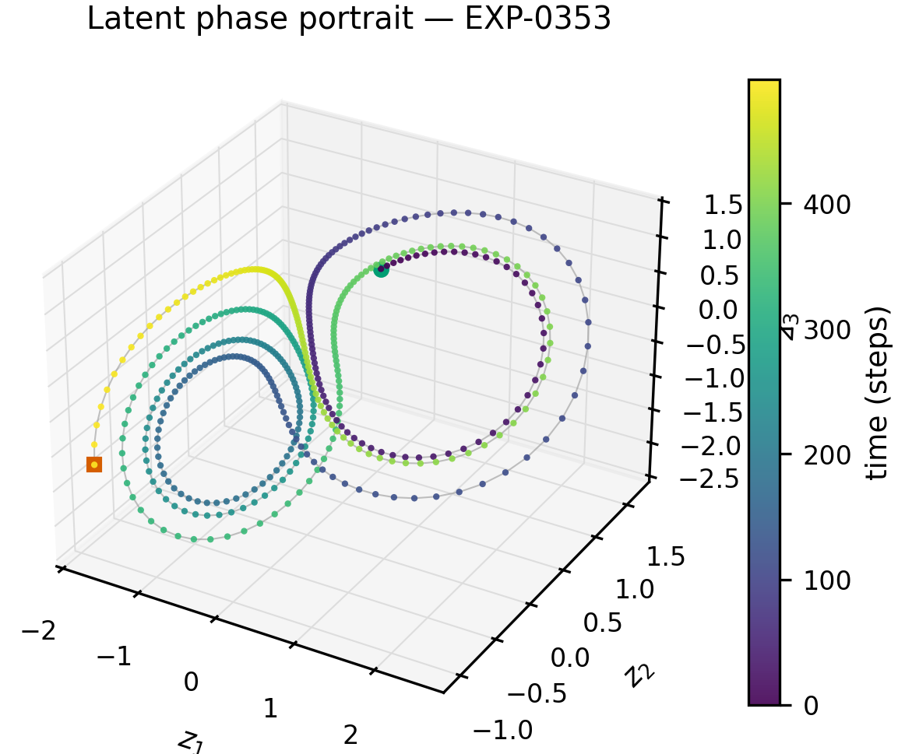
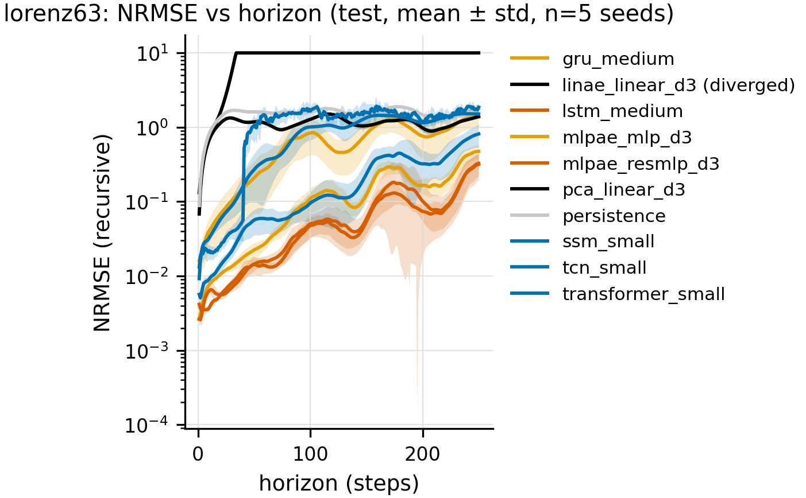
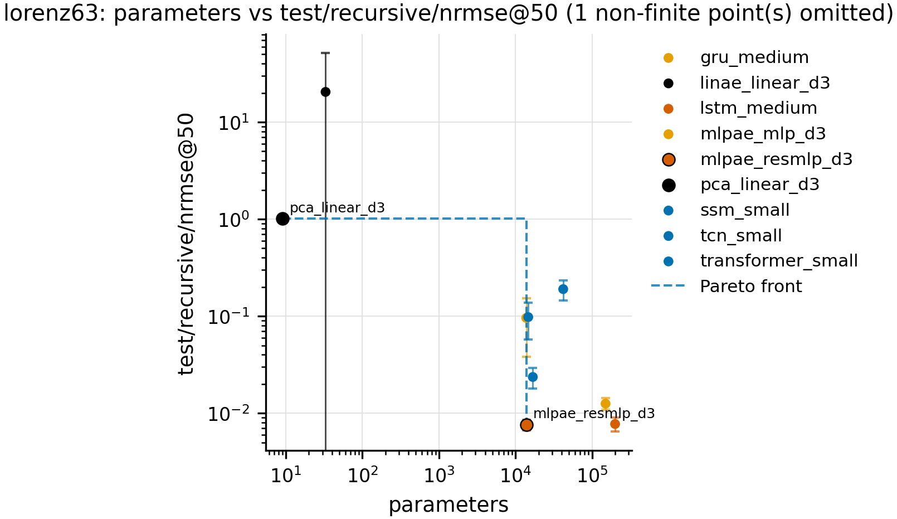

# Neural State-Space Compiler

**Neural State-Space Compiler (`nssc`) automatically discovers compact latent dynamical
systems from high-dimensional temporal observations.**

Given multivariate observations `x_{1:T}, x_t ∈ R^D`, the compiler profiles the data,
searches over candidate latent dimensions, encoders and latent-dynamics families,
scores every candidate on reconstruction, one-step prediction, long-horizon rollout,
complexity and stability, and emits a compiled model

    z_t = E_φ(x_≤t),   z_{t+1} = F_θ(z_t),   x̂_t = D_ψ(z_t),   d ≪ D

together with a report explaining *why* that model was selected.

> **Status:** research code under active development. Every number in this README, in
> `results/`, and in the figures is produced by scripts from registered experiment runs
> (`results/registry.jsonl`, 700+ runs). Experiments still running are marked as such.

## Research question

> Can we automatically compile high-dimensional temporal observations into a
> low-dimensional, structured, predictive state-space representation that preserves the
> underlying dynamics better than simply fitting a large sequence model?

Hypotheses H1–H7 and their falsification criteria: [research/hypotheses.md](research/hypotheses.md).

## Architecture

```
raw temporal dataset
   ↓  DatasetProfiler          intrinsic dim (PCA / MLE / corr-dim), autocorrelation, noise, stationarity, chaos hint
   ↓  CandidateGenerator       latent dims × encoders × dynamics families (registry-driven)
   ↓  StagedSearch             screen → fine → final; resumable; every run registered + checkpointed
   ↓  Evaluator + Stability    recon / teacher-forced / recursive rollout; Jacobian spectra, Lyapunov, norm growth
   ↓  MultiObjectiveScorer     J = λ1·recon + λ2·1-step + λ3·rollout + λ4·complexity + λ5·instability
   ↓  CompiledModel + report   selected model, ranking, data-derived reasons
   ↓  Explorer dashboard       latent trajectories, phase portraits, vector field, counterfactual rollouts
```

Components (all registered, so new families plug in without touching the compiler):

| encoders | dynamics | baselines |
|---|---|---|
| PCA, linear AE, MLP AE, temporal conv (TCN), GRU/LSTM, diagonal SSM, **multi-scale slow/fast** | linear, affine, MLP, residual MLP, Koopman (lifted linear), neural ODE (RK4), SSM, **multi-scale**, Gaussian (probabilistic) | persistence, mean, GRU, LSTM, TCN, Transformer, SSM forecasters |

Details: [docs/architecture.md](docs/architecture.md), [docs/compiler.md](docs/compiler.md).

## Installation

```bash
git clone https://github.com/sunkalpchandra/neural-state-space-compiler
cd neural-state-space-compiler
pip install -e ".[dev]"            # + ".[dashboard]" for the explorer, ".[eeg]" for real data
pytest -q -m "not slow"           # ~1 min
```

## Quick start

```bash
nssc smoke                                              # tiny end-to-end run (seconds)
nssc data list                                          # synthetic systems
nssc profile  --config configs/datasets/lorenz63.yaml   # dataset profile
nssc train    --config configs/experiments/lorenz63_mlp_resmlp.yaml
nssc compile  --config configs/compiler/tiny.yaml       # tiny compiler run (< 1 min)
nssc compile  --config configs/compiler/lorenz63.yaml   # real compiler run (hours, resumable)
nssc benchmark --suite synthetic_core                   # baselines vs latent models, 5 seeds
nssc tables   --suite synthetic_core --reference mlpae_resmlp_d3
nssc visualize --compile-dir results/compile/lorenz63
nssc report   --compile-dir results/compile/lorenz63
nssc dashboard                                          # http://127.0.0.1:8050
```

Python API:

```python
from nssc.compiler import StateSpaceCompiler
from nssc.utils.config import load_config

compiler = StateSpaceCompiler(load_config("configs/compiler/lorenz63.yaml"))
compiled = compiler.run()              # profile → candidates → staged search → select
print(compiled.report.to_markdown())   # selected d / encoder / dynamics + reasons
x_hat, z_hat = compiled.rollout(x_context, horizon=250)
```

## Compiler output

Real run: `nssc compile --config configs/compiler/lorenz63.yaml` (84 candidates = d∈{2,3,4,8} ×
{PCA, linear, MLP, TCN, GRU} encoders × {linear, residual MLP, Koopman, neural ODE, SSM} dynamics;
screen 12 ep → fine 50 ep → final 120 ep × 3 seeds; 127 registered runs). Full report:
[results/compile/lorenz63/compile_report.md](results/compile/lorenz63/compile_report.md).

```
Selected latent dimension: 3
Selected representation:   mlp  (decoder mlp)
Selected dynamics:         residual_mlp
Parameters:                13833
Reason:
- selected has -40.1% rollout NRMSE vs runner-up linear+koopman@d3 (0.0164 vs 0.0273)
- +168% parameter count vs runner-up (13833 vs 5169)
- smallest candidate linear+residual_mlp@d3 (4635 params) has 2.36× the selected model's rollout NRMSE
- stability: verdict=stable, max local spectral radius 1.103, λ_max≈0.432/step, blow-up fraction 0.00
- validation recon NRMSE 0.0006, one-step NRMSE 0.0005; aggregated over 3 seeds
```

| stage | candidates → survivors | what was pruned |
|---|---|---|
| screen (12 ep, 1 seed) | 84 → 30 | every PCA/linear-dynamics and most SSM-dynamics candidates (rollout NRMSE ≈ 1 or diverged) |
| fine (50 ep, 1 seed) | 30 → 4 | GRU/TCN encoders (5–15× the parameters for no rollout gain) |
| final (120 ep, 3 seeds) | 4 → 1 | Koopman runner-up (1.7× rollout error), one d=4 candidate diverged in a seed |

<p align="center">
<br>
 
</p>

## Benchmarks

Suite `synthetic_core` (`nssc benchmark --suite synthetic_core`): 3 systems × 10 models × 5 seeds,
40 epochs each, trajectory-level splits, recursive rollout from a 20-step context on the **test**
split. Baselines are trained teacher-forced only ([D-008](research/decisions.md)). Full table with all
horizons and paired tests: [results/tables/synthetic_core.md](results/tables/synthetic_core.md).

Test recursive NRMSE (mean ± std over seeds 0–4):

| model | params (Lorenz) | Lorenz-63 @50 | Lorenz-63 @250 | Van der Pol @250 | Lorenz-63 high-dim (D=64) @50 |
|---|---|---|---|---|---|
| **latent: MLP AE + residual MLP, d=3** | 13.8k | **0.0076 ± 0.0010** | 0.075 ± 0.036 | 0.0030 ± 0.0010 | 0.95 ± 0.42 (diverges) |
| latent: MLP AE + MLP, d=3 | 13.8k | 0.096 ± 0.058 | 0.66 ± 0.26 | 0.0032 ± 0.0010 | 0.86 ± 0.07 |
| latent: PCA + linear, d=3 | 9 | 1.010 ± 0.012 | 1.13 | 0.52 | 1.13 |
| latent: linear AE + linear, d=3 | 33 | diverged | diverged | 0.62 | 1.06 |
| LSTM (medium) | 200k | **0.0077 ± 0.0013** | **0.065 ± 0.013** | **0.0027 ± 0.0010** | **0.130 ± 0.001** |
| GRU (medium) | 150k | 0.0125 ± 0.0017 | 0.137 ± 0.029 | 0.080 ± 0.067 | 0.132 ± 0.005 |
| TCN (small) | 16.9k | 0.0236 ± 0.0056 | 0.221 ± 0.077 | 0.0066 ± 0.0036 | 0.192 ± 0.013 |
| Transformer (small) | 42k | 0.190 ± 0.044 | 1.25 | 1.18 | 0.293 ± 0.020 |
| SSM (small) | 14.7k | 0.098 ± 0.040 | 0.90 | 0.48 | 0.309 ± 0.048 |
| persistence | 0 | 1.295 | 1.53 | 1.34 | 1.26 |

What the numbers say so far (neutral reading):

* On Lorenz-63 and Van der Pol with identity observations, a ~14k-parameter latent state-space model
  matches the best sequence baseline (LSTM, 200k) at 50–250 steps and beats GRU/TCN/Transformer/SSM;
  paired t-tests vs GRU/TCN/Transformer p < 0.01 (n=5; Wilcoxon floor 0.0625).
* The residual parameterisation of the latent dynamics matters (12× at 50 steps on Lorenz-63); linear
  latent dynamics diverge on chaotic data even though their one-step error is small — the reason
  selection is multi-objective rather than one-step MSE.
* On the **high-dimensional, noisy observation** variant the *hand-picked* d=3 latent model fails while
  LSTM/GRU do not. This is precisely the regime the compiler is for; the compiler run on that dataset is
  in progress and its result — positive or negative — will be reported here.

<p align="center">
 
</p>

## Interactive demo

`nssc dashboard` serves a dark, instrument-style explorer: raw signal, learned latent
state, latent phase portrait, true-vs-predicted rollout with adjustable horizon,
latent vector field, local Jacobian eigenvalues, the compiler's decision table, and
counterfactual rollouts from an edited initial state.

## Reproducibility

Every run records seed, dataset version (config hash), full config, git commit,
parameter count, training time, hardware, metrics and checkpoint path in
`results/registry.jsonl` (`EXP-####`, append-only; failed runs are kept). Splits are
always trajectory-level (or subject-level for EEG). `scripts/reproduce.sh
{smoke,compile,ablations,benchmark,figures}` re-runs each block. See
[docs/reproducibility.md](docs/reproducibility.md).

## Project structure

```
configs/{datasets,models,experiments,compiler}   YAML (every experimental setting is explicit)
src/nssc/data            synthetic systems (11), observation maps, real loaders, trajectory splits
src/nssc/representations encoders/decoders        src/nssc/dynamics   latent transition families
src/nssc/compiler        profiler, scorer, report, StateSpaceCompiler
src/nssc/search          candidate space, resumable staged search, suite runner
src/nssc/stability       spectra, Lyapunov, norm growth     src/nssc/uncertainty  probabilistic rollouts
src/nssc/metrics         central metrics                    src/nssc/evaluation   protocols, OOD, failure analysis, tables
src/nssc/baselines       sequence-model forecasters         src/nssc/visualization figures (script-generated)
dashboard/               FastAPI + Plotly explorer          tests/{unit,integration,regression}
research/                hypotheses, experiment log, failures, decisions, open questions
```

## Experiments

The experiment matrix (A–L) and review gates are in [docs/experiments.md](docs/experiments.md);
the running log is [research/experiment_log.md](research/experiment_log.md).

## Citation

```bibtex
@software{chandra2026nssc,
  author = {Chandra, Sunkalp},
  title  = {Neural State-Space Compiler},
  year   = {2026},
  url    = {https://github.com/sunkalpchandra/neural-state-space-compiler}
}
```

## License

MIT — see [LICENSE](LICENSE).
